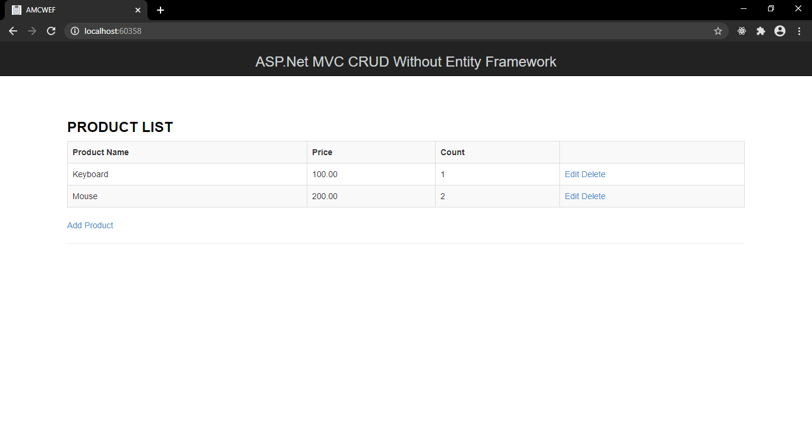

# ASP.NET MVC CRUD WITHOUT ENTITY FRAMEWORK

* Purpose: My Project
* Used IDE: MS Visual Studio 2019
* Target Framework: .Net Framework 4.7.2
* Web Application Framework: ASP.Net
* ASP.Net Programming Models: MVC (version 5.0.0)
* Front End: HTML5, CSS3, Bootstrap 3.0.0, jQuery 1.10.2
* Back End: C#, MS SQL Server 2017
* Responsive Web Design: Yes
* Type of Website: Dynamic

<h2> User Interface Screenshot </h2> 
  
    